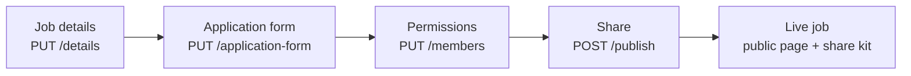
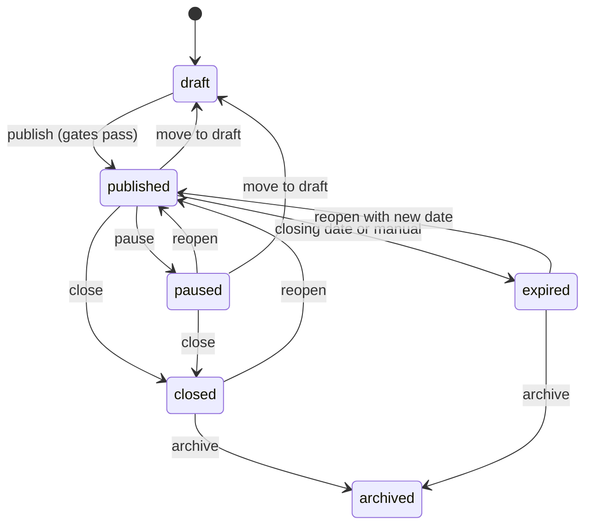
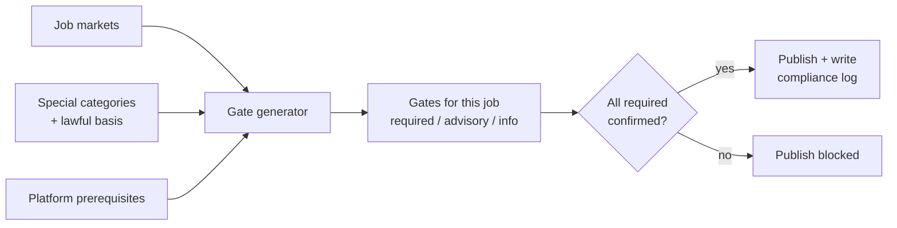

# OpenHR Job Creation: Server Plan

Sep 24, 2026 (KYB added 5 Oct; updated 8 Oct with the team's answers of 7 Oct) · @Adedola Owen Abaru

## Summary

Build job creation as a new `hiring` domain in each regional database, driven by a four-step draft that mirrors the wizard, and ship it in four phases: draft and form builder first, then publish and public job pages, then applications, then third-party distribution.

The key design choices:

- **Draft-first, saved by data section.** A job is created as a draft on first "Save as draft". Progress is tracked per data section (basics, markets, compensation, screening, documents, data protection, compliance, team), so the 4-screen design and the PRD's 8 steps can both use the same API.
- **The application form is data, not code.** Questions are rows with a `type` and a JSON `config`, validated by a Go registry of the 15 question types, with knockout rules and special category tags. On publish the form is frozen into a versioned snapshot.
- **Compliance gates are data too.** The PRD's gate catalog (`uk-lawful`, `eu-pay-trans`, ...) lives in a table. Gates are generated from the job's markets, special categories and Open HR's own prerequisites; every confirmation goes to an append-only log.
- **Everything for a company lives in the company's region.** The company's country at setup picks the region, and it locks once the company holds personal data (7 Oct answer; this replaced "applicant data in the candidate's region"). The global database only holds IDs and regions (`public_id → region`), no personal data.
- **Publishing is gated; drafting is not.** Publish needs a verified company (KYB), accepted terms including the DPA, every required gate, a lawful basis and pay rules met. Any edit to a published job that touches markets, salary, screening rules, workflows or special-category fields re-runs the gates, and so does resuming a paused job. Who can do what comes from the seven-role permission matrix.
- **Share Kit and Google for Jobs first.** Free share links with source tracking plus `JobPosting` structured data ship with publish; Indeed and country boards come later behind one `Distributor` interface.

## Product decisions (5 Oct)

Product answered the open questions; the biggest server impact is that **publishing now depends on KYB**, so company verification is built first, as phase 0b, before job creation (phase 1).

| Decision | Server change |
| --- | --- |
| Companies can create jobs but **cannot publish until verified** | Publish gate on `organizations.kyb_status = verified`, no feature flag. KYB (designed in the KYB V2 doc) is built first as phase 0b, before job creation |
| Pay transparency is a **hard block** | `eu-pay-trans` and `us-pay-trans` stay `required`; no override path |
| "Anywhere" and timezone jobs follow **every supported country's** rules | Gate generator expands `anywhere` / `specific_timezone` to all open markets |
| ~~**Keep** sexual orientation in self-ID~~ Reversed 7 Oct: remove it at launch (Counsel to confirm) | Question removed; see Sensitive data store |
| Criminal records cite **Art. 10** | Gate and UI copy updated |
| ~~UAE applicant data goes to the **Asia** region for now~~ Superseded 7 Oct: the UAE is not a launch market | No UAE market in `hiring.markets` |
| DPA is part of the **terms and conditions**, highlighted before the user publishes a job | Record T&C + DPA version accepted at signup (who, when, version); show and re-confirm on first publish; publish gate checks a current acceptance exists. Drafting is allowed before it, which is defensible because no applicant data arrives until publish. Refined 7 Oct: the DPA stays a separate versioned document accepted with the same click (see Team answers) |
| **Philippines removed** for now | `PH` closed in `hiring.markets`; its gates stay in the catalog, inactive |
| EU representative: an EU entity (Estonia or Ireland) or a service such as VeraSafe (decided 7 Oct: VeraSafe); Nigeria and Kenya: legal consultant this week; India: nothing yet | Tracked in `platform_prerequisites`; EU, NG and KE stay closed until done |
| US gates: product is reviewing | No change yet |
| Design will add knockout switches, legal reason and retention fields, the country checklist on Share, and the Permissions and Share screens; it will also settle Checkbox vs Multiple choice, templates and CV rules | Server builds to the plan; frontend waits on these screens |
| Roles: the [Roles and permissions doc](https://docs.0110100001110010.org/doc/roles-and-permissions-XGgv2TGF5R) is the source of truth | See Roles and permissions below |

## Team answers (7 Oct)

The team answered all 48 open questions on 7 Oct. The full text, with who owns each follow-up, is in `open-questions-for-team.md`. Answers marked **Proposed** or **Counsel** are not final. The sections below are updated in place; this table lists what changed the plan.

| Topic | Answer | Server change |
| --- | --- | --- |
| Residency | The key is the company's country at setup, locked once personal data exists. Not per job, not the candidate's location (**Proposed**; Tech lead and Legal sign it in BE-01a) | Applicant data is stored in the company's region. `job.residency.region.set` is ✗ for every role. Nigeria and Kenya have no hyperscaler region: proposed to store them in the `uk` region with a documented transfer mechanism, pending counsel. The `africa` region goes unused for now |
| Markets | Build UK, EU, US, India, Nigeria and Kenya, each behind its own switch. Singapore, the Philippines and the UAE are out | `hiring.markets` carries the six; the apply form asks the candidate's country and accepts only the job's markets |
| Our obligations vs customer gates | `eu-rep`, `eu-scc`, `ng-cbdt` and `ke-loc` are Angle's own obligations | Move to `platform_prerequisites` as market-switch conditions; they never show as customer checkboxes. Market switches are set from an internal Angle admin screen, with an evidence link and a log entry |
| Roles | Seven roles, with new `member.*` permissions, `job.status.change`, `job.export`, `job.manage_any`, and `job.collaborator.add_limited` | See Roles and permissions |
| Edits after publish | Edits to markets, salary, screening rules, workflows or special-category fields re-run the gates | Publish checks run on those edits and on resume |
| Sexual orientation | Removed at launch (**Counsel**) | Dropped from self-ID; it can return only inside the EDI module, enabled by Legal |
| Knockouts | No automatic rejection in any market at launch. A failed knockout flags the candidate for human review | A workflow Reject step creates a review task. No bulk "reject all flagged": each flagged candidate is opened first, and the review is logged (**Counsel**) |
| Automated screening | Any rule or AI that rejects, scores, ranks, filters or hides candidates, including assessments with a pass mark | Needs an org-level DPIA recorded in-app by Legal before the first screening job is published; each job confirms it is within scope |
| Retention | Only Legal changes it, within the market's minimum and maximum; defaults per category and market (**Counsel**, due 16 Oct) | Retention follows the candidate's own country and the data category. See the conflict note in the Kenya row below |
| Description | Store the editor's JSON as the source | Sanitised HTML is rendered at publish with an allow-list sanitiser; emails get plain text; never store HTML from users |
| CV upload | PDF only at launch; 5 MB free, 10 MB paid | Limit read from the employer's plan; scan every file in our own region (for example ClamAV), never a public multi-scanner |
| Duplicate jobs | A warning, not a block | Same company, same normalised title and locations, and the other job is draft, published, paused or closed in the last 30 days |
| Reapply block | Optional, off by default, 6 months | Keep only an HMAC of the email (per-company secret), job ID, rejection date and end date |
| DPA | Separate versioned document accepted with the T&C click; only Founder or Legal can accept it | Version and signatory stored; a new version has 30 days' notice, after which new publishes are blocked while live jobs keep running |
| Notices | The customer is the controller; Angle Open Source Ltd appears as processor | Add a required privacy contact (and DPO if any) to company setup, checked before publish |
| Public pages | One shared domain with an org path at launch; slugs claimed only after KYB is verified | Slug unique per company, old slugs redirect after a rename |
| Assessments | Link to a third-party tool | Store the link and completion only, no scores. Use one link for every candidate, with no personal data in it |
| Job boards | Google for Jobs and share links at launch; the rest show "Coming soon" | No push integration at launch |
| Anywhere / time-zone | "Anywhere" selects every switched-on market at publish; later markets are not added to live jobs | Gate generator expands to the open markets |
| Wording checks | A fixed, versioned list per market, not an AI classifier | Checks title and description as well as questions; only Founder, HR 1 or Legal can override a flag |

## PRD coverage check (Job Creation Flow V2)

Checked against the PRD dated 22 June 2026: the first version of this plan covered about half of it. The biggest misses were the compliance gate engine, lawful basis, screening rules and where applicant data is stored. Every row marked **Added** is now built into the sections below.

| PRD requirement | First plan | Change |
| --- | --- | --- |
| Step 1: Structured JD (about the company, role, responsibilities, requirements, benefits, hiring process) and AI co-writer using sources such as the company's LinkedIn | One description field; AI in phase 4 | **Added** `description_sections` JSONB with the six fixed keys, plus a rendered HTML copy for JSON-LD. AI stays in phase 4 (outside the 8-week sprint unless PL-01 brings it in); company sources come from the company's website URL, not LinkedIn |
| Step 1: Employment type includes internship; seniority entry / mid / senior / lead / director | Freelance/contract only; seniority catalog | **Added** `internship`; seniority seeded with the PRD's five levels |
| Step 2: Several markets per job (UK, EU, NG, KE, SG, PH, IN, AE; since 7 Oct the launch set is UK, EU, US, IN, NG, KE) | One `country_id` | **Added** `hiring.job_markets` join table and a global `hiring.markets` catalog |
| Step 2: Warnings shown as soon as a market is picked (Kenya s.50, India DPDP Rules; the UAE warning is dropped with its market) | Missing | **Added** `GET /hiring/markets` returns each market's warnings; the frontend shows them on selection |
| Step 3: Pay required only when the EU is selected; nine currencies; show-range toggle with EU warning | Pay rules by country | **Covered**, now keyed on markets. Currency list limited to GBP, EUR, USD, NGN, KES, INR (SGD, PHP and AED dropped with their markets on 7 Oct) |
| Step 4: Custom questions checked for discriminatory wording per market; publishing needs a logged override | Salary-history warning only | **Added** question screening rules per market (a fixed, versioned list, not an AI classifier; it also checks the title and description), with `override_reason`, user and time stored on the question |
| Step 4: Knockout questions; failed answer disqualifies and stores question ID + answer on the candidate | Missing | **Added** `knockout` rule on choice, number and yes/no questions; checked on submit; result stored on the application |
| Step 4: Auto-disqualification rules (right to work, minimum years) | Missing | **Added** `hiring.disqualification_rules` per job, run on submit |
| Step 4: Linked assessment tests, completion required before review | Missing | **Added** as a placeholder `assessment` link on the job; the assessment product itself is out of scope here |
| Step 5: CV upload PDF only, 10 MB; URL fields LinkedIn, GitHub, Portfolio with custom labels required | PDF/DOCX/ODT, 5 MB | **Changed** to follow the PRD (see the next section for the conflict with the design). 7 Oct: PDF only, 5 MB on free and 10 MB on paid |
| Step 6: Lawful basis (contract, legitimate interests, consent, legal obligation), required; consent carries a warning | Missing | **Added** `lawful_basis` on the job, required to publish; legitimate interests needs an LIA reference; consent returns a warning |
| Step 6: Special categories include biometric data | Four categories | **Added** `biometric` |
| Step 6: Retention per job, 3 / 6 / 12 months, default 6 | Per-org setting | **Changed** to per job; the Fluvio retention task reads it. 7 Oct: only Legal can change it, within the market's minimum and maximum, and the period follows the candidate's own country |
| Step 7: Compliance gates by market, `required` / `advisory` / `informational`, with IDs such as `uk-lawful`, `eu-pay-trans`; continue is disabled until required gates are confirmed | A general rules table | **Added** a gate catalog and per-job confirmations (see Compliance) |
| Step 8: Review summary; post-publish prompt for applicant intake | Preview only | **Added** `GET /jobs/{id}/review` summary including gate status |
| Section 3.9: Immutable compliance audit log with gate ID, severity, time and user | General audit events | **Added** append-only `hiring.compliance_log`; a trigger rejects `UPDATE` and `DELETE` |
| Section 6: Applicant data routed by the candidate's declared location, not the employer's region | Stored in the org's region | **Changed twice.** First to the candidate's region; since 7 Oct the company's region (see Applicant data residency) |
| Section 6: Kenya s.50 may need a dedicated Kenya bucket | Missing | **Added** storage routing keyed on country, falling back to region, so a Kenya bucket is a config change |
| Section 7: Platform prerequisites per market (EU Art. 27 representative, NDPC/CBDTI, ODPC, Singapore DPO, NPC, UAE regime) | Missing | **Added** `hiring.markets.is_open` and platform-level gates; a closed market cannot be picked. Singapore, the Philippines and the UAE are out of scope since 7 Oct |
| Section 7: Job-specific applicant privacy notice linked from the posting | Missing | **Added** a notice generated from lawful basis, data collected, retention and rights, served at `/j/{public_id}/privacy` |
| Market notices on the job page: Singapore DPO contact, India notice in English plus one scheduled language, Nigeria opt-in cookies, Philippines rights notice | Missing | **Added** to the server-rendered job page; the page sets no non-essential cookies. The Singapore and Philippines notices are dropped (7 Oct); the India language option depends on counsel (Q30) |
| Section 8: Form collects only data the employer has a declared basis for | Missing | **Added** form save rejects special category questions whose category is not declared |
| Section 8: DPA must be signed before the job flow opens | Missing | **Added** `accounts.organization_agreements`; `POST /jobs` returns `403 dpa_required` without one |

## Where the PRD and the designs disagree

The server should not hard-code either UI. It tracks progress by **data section** (`basics`, `markets`, `compensation`, `screening`, `documents`, `data_protection`, `compliance`, `team`) instead of by screen, so the 4-screen Figma flow and the 8-step PRD flow can both save to it. Publish checks sections, not screens.

| Topic | PRD says | Figma / first plan says | Server default until decided |
| --- | --- | --- | --- |
| Number of steps | "Six-step wizard", but lists 8 steps plus an audit section | 4 screens: Job details, Application form, Permissions, Share | **Decided: Figma flow.** Progress stays section-based, and the PRD's extra steps sit inside the 4 screens (see Wizard steps) |
| Location | Several markets | One country + anywhere / specific area | Several markets; the design's single country becomes a market list of one |
| US | Not a launch market | Preview job is in San Francisco; `waitlist.countries` has the US | **Decided: US opens at launch.** Stored in the `us` region; needs its own gates (see Compliance) |
| South Africa | In the state model (`ZA`) and privacy notice notes, not in the market table | Country row exists but inactive | Closed |
| UAE storage | "Asia-Pacific / Middle East region" | Only 5 regions exist; no Middle East region | **Decided 7 Oct:** the UAE is out of scope, so there is no UAE market or data |
| CV upload | PDF only, 10 MB | PDF, DOCX, ODT, 5 MB | **Decided 7 Oct:** PDF only; 5 MB on the free plan and 10 MB on paid plans, read from the employer's plan; DOCX later, converted to PDF on upload |
| Employment type | Full-time, part-time, contract, internship | Full time, part time, freelance/contract | `full_time`, `part_time`, `contract`, `internship` |
| Special categories | Adds biometric | Four checkboxes | Five categories |
| Kenya retention | `ke-retention`: employment duration plus 6 years | Retention options 3 / 6 / 12 months, default 6 | **Decided: 12 months.** `KE` gets `min_retention_months = 12`, so Kenya jobs are fixed at 12; the `ke-retention` gate text changes to match. **Conflict, 7 Oct:** the team's retention proposal (Q24) gives rejected applicants a default of 6 months and a maximum of 12 in every non-US market, Kenya included, "until counsel says otherwise". Confirm which one holds |
| Pay disclosure in the EU | "Must be disclosed in the posting" | Same | Required and visible for EU jobs; note the Directive also allows disclosure before interview, so counsel may relax this per member state. **7 Oct:** keep the block for launch, and check the range is shown (`show_publicly`), not just stored |
| Criminal records | Treated under Art. 9 | Same | Record it under Art. 10 in the gate text |

## What the Figma file adds

Read from the [Job creation Flow page](https://www.figma.com/design/7jCMwDng7HF5g7F3tGXf0E/Open-HR?node-id=4125-7694), including its dev notes. The file covers more than the wizard: a full jobs list with six statuses, bulk actions with undo, export and access tiers. None of that was in the plan yet.

### Job creation screens

| Finding | Where in Figma | Server change |
| --- | --- | --- |
| Step order is Job details, Application form, Permissions, Share | Latest Job details and Application form frames | Settles the open question. Permissions and Share screens are not designed yet, apart from an integrations banner and a "role has been created" screen with Copy job link |
| Third hiring option is **Specific timezone**. Dev notes: full timezone list, plus a UTC offset list | Location & workspace | `location_mode`: `anywhere`, `specific_area`, `specific_timezone`; store IANA zones and UTC offsets; `GET /hiring/timezones` |
| Location is already **multi-select**, down to city level ("United Kingdom", "European Union", "Lagos, Nigeria" as chips) | Job details 5395:50633 | Matches `job_markets`; add optional `city` / `subdivision` per entry. One of the four PRD design asks is already done |
| "Anywhere" shows a banner saying the role is open worldwide | Dev note | Decided 7 Oct: Anywhere selects every switched-on market at publish, so the strictest salary rule applies (an EU range). Markets switched on later are not added to live jobs; the employer re-publishes, which runs the new gates. Time-zone jobs: the employer picks the countries |
| Department and industry accept values not in the list; seniority and years of experience are fixed lists; skills autocomplete and save free text on Enter | Dev notes | Org-level custom departments (planned) plus custom industries; seniority and experience stay catalogs; skills take `skill_id` or `custom_label` (planned) |
| Required on Save & continue: title, department, hiring option, travel frequency, visa policy, employment type, pay type | "Error state for mandatory inputs" | Exact field list for `PUT /details` validation |
| When editing a live job, "Save as draft" becomes "Save changes" | Dev note | Editing an open job updates it in place: re-run publish checks, bump the form version if questions change, re-sync channels |
| Question picker: Input (short text, long text, number, email, phone), Choice (single, multiple, checkbox, dropdown, linear scale), Other (image, file upload, link, **time**, date) | Picker frames | Add a `time` question type. Autofill with resume is a system field, not in the picker |
| Checkbox and Multiple choice look identical in the preview | Form blocks | Answered 7 Oct: a checkbox question allows several answers and multiple choice allows one. Design makes them look different (square boxes against round radio buttons) and may rename them "Multiple answers" and "Single answer". They stay separate types, and knockout rules differ (any against all of the selected answers). The registry below has `single_choice`, `multiple_choice` and `checkbox`, so check those names against this answer |
| Special category list in the newest component has five items, including Biometric and "Criminal records / DBS" | Component 4519:46316 | Matches the plan |
| CV file rules differ between frames: "Size limit: 10 MB" (older flow) and "DOCX, DOTX, PDF, max 5 MB" (newer blocks) | Upload blocks | Settled 7 Oct: PDF only, 5 MB on the free plan and 10 MB on paid plans |
| Optional self-ID questions (gender, sexual orientation, race, veteran, disability, "I choose not to disclose") behind "My company is required to capture..." | Older template flow | Store with the special category answers. Decided 7 Oct: remove the sexual orientation question at launch (Counsel to confirm) and take it off the screen |
| Integrations banner: LinkedIn, Indeed, Google for Jobs, ZipRecruiter, TargetJobs, "Connect integrations" | Empty jobs page | Org-level `hiring.org_integrations` table (per-org credentials and status); per-job channels stay as planned. 7 Oct: at launch the page shows Google for Jobs and share links, and LinkedIn, Indeed, ZipRecruiter and TargetJobs show "Coming soon" |

### Jobs list and actions (not in the plan before)

| Finding | Server change |
| --- | --- |
| Six statuses, shown in this order: Open, Paused, Draft, Closed, Archived, Expired | Keep `published` as the stored status (Backend v2 is the source of truth) and show it as "Open" in the UI; add `paused`, `closed` and `expired` (see Job lifecycle) |
| Tabs: All job listing, Drafts, Archived, Templates, with counts | `GET /jobs/counts` returning a count per status and templates |
| List and grid (board) views; dragging a card between columns changes its status | Board drag calls the same status-change endpoint; illegal moves are rejected with a reason |
| Columns: title, department and job type, managed by (one or more people), location, total applicants, new applicants, date posted | List response includes managers, locations, `applicant_count`, `new_applicant_count`, `published_at`; counts kept as columns updated when applications arrive |
| Search filters by title and department, with title ranked higher | Postgres full-text search, title weighted above department |
| Filters with multi-select (counts on the chip), sort | `GET /jobs` filters: status, department, manager, location, job type; sort by posted date, closing date, title, applicants |
| Bulk selection (with shift-select) and actions: pause, close, archive, move to draft, move to expired, reopen, change closing date, assign to, export, delete | `POST /jobs/bulk` with `ids` + `action`; returns per-job results, since some jobs in a mixed selection may not allow the action |
| The available status list depends on the job's current status; "Change closing date" only shows when an open job is selected | Server exposes allowed actions per job (`allowed_actions` in list and detail) so the menus don't hard-code the rules |
| Undo after a status change | Status changes return an `undo_token` valid for a short time; `POST /jobs/bulk/undo` restores the previous statuses |
| Duplicate jobs (JCHF §7 said block) | Decided 7 Oct: a warning, not a block. A duplicate is the same company, same normalised title and same set of locations, where the other job is a draft, published or paused, or was closed in the last 30 days. The warning links only to jobs the user can see, and "This is a different role" continues and is logged |
| "Assign job to" and "Assign to me" | `PUT /jobs/{id}/managers` (and bulk); managers live in `job_members` with role `hiring_manager` |
| Export per job to CSV or JSON: title, department, status, managed by, dates, applicant counts and custom form fields; gated by the same access tiers as job creation | `POST /jobs/export` returning a file; runs as a background task for large exports |
| Access tiers: notes mention "tier 2 vs tier 3" users and "users with limited permission", and that role-based access will become flexible | Build permission checks around named permissions rather than hard-coded roles. 7 Oct: tiers map to roles (Tier 2 is HR 2, Tier 3 is Line manager) and the keys are `job.export` and `job.manage_any` (see Roles and permissions) |

## Where the codebase stands

The server (`staging` branch) already has every building block job creation needs except the domain itself; nothing job-posting related exists yet.

| Area | What exists today | How the job feature uses it |
| --- | --- | --- |
| HTTP | chi router under `/api/v1`, `RequireAuth` group, swag godoc + `make swagger` | New `JobsHandler` with `RegisterProtectedRoutes` and a public route group |
| Data | 5 regional Postgres DBs via `dbrouter` + a global DB; goose migrations; SQL via `sql-go-query-builder` in `internal/query` | New `hiring` schema per region (migration `000004_hiring.sql`), queries in `internal/query/hiring.go`; add `hiring` to `regionalSearchPath` |
| Region routing | JWT carries `user_id` + `region`; `resolvePool` picks the pool; `RegionGlobal` for pending accounts | Job endpoints require a real region (pending accounts cannot create jobs) |
| Organisations | `accounts.organizations`, `organization_members` with roles `owner` / `member`, invites | Org context middleware; job-level team roles on top |
| Files | One R2 (S3-compatible) client + bucket per region | CV, image and file-upload answers stored in the org's regional bucket via presigned URLs |
| Background work | Fluvio queue in the global DB, `email-worker` binary | Auto-close at closing date, Google indexing pings, Indeed sync, applicant emails |
| Catalogs | Global catalog tables (slug, sort\_order, is\_active), e.g. `onboarding_industries` | Reuse industries; add seniority, experience and skills catalogs the same way |
| KYB | Designed in `DESIGN_accounts.md` and the KYB V2 doc; built first as phase 0b (the `kyb_status` migration is `000005_kyb.sql`) | Publish gate reads it; no feature flag (5 Oct decision). Full design in Company verification (KYB) below |

Two constraints to design around. First, `maxRequestBodyBytes` is 1 MB, so file answers must go straight to R2 with presigned URLs, never through the API. Second, `/admin/jobs` already means Fluvio background jobs, so the new code should use the words **hiring** / **job posting** in package, table and tag names (`internal/hiring`, `hiring.job_postings`, tag `hiring/jobs`) while the public URL can still be `/jobs`.

## Wizard steps and what each needs from the server

Each wizard step maps to one save endpoint and one entry in the job's `completed_steps`, so the frontend can resume any draft at the right step.



The two design versions show different step orders ("Permissions → Share" vs "Share → Team members"); the plan assumes Permissions comes before Share because publishing should happen last.

| Step | UI elements (from the designs) | Server needs |
| --- | --- | --- |
| Job details ("About the role") | Title (70 chars, no special chars), department, closing date, auto job ID (JB-92), where you're hiring (anywhere / specific area / third option), country, same as company address, workplace type, travel frequency, visa sponsorship, rich-text description with Generate, industry, employment type, seniority, years of experience, skills, pay (exact or range, currency, hourly/monthly/annually), show on career page, EU pay transparency notice, save as template | Job record + per-org job number; department, skills and catalog lookups; org address lookup; rich-text stored as editor JSON and sanitised to HTML at publish; duplicate-job warning; pay rules per location; job templates; AI description endpoint (later) |
| Application form | Fixed sections (Personal information, Profile, Eligibility/availability/compensation, Screening questions), add question picker with 15 types, required toggles, delete, drag to reorder, locked system fields (full name, email), special category checkboxes, keep setup for future jobs, live phone preview | Form + questions tables, type registry with config validation, ordering, system-field rules, special category declarations, org default form template, preview payload |
| Permissions / Team members | Who can see and act on this job | Job-level members and roles; org member search |
| Share | Publish, share links, channels | Publish gate, public ID, global registry entry, share kit URLs with source tracking, Google for Jobs data, distribution status |
| Top bar | Save as draft, Preview | Lenient partial save (`PATCH`); preview endpoint that returns exactly what candidates will see |

### PRD steps inside the Figma flow

The Figma flow is the build target, so each PRD step has to live on one of the four screens. Four things need design work before the frontend can build it; the server supports them either way.

| Figma screen | PRD steps it absorbs | Design change needed | Server calls |
| --- | --- | --- | --- |
| Job details | 1 Basics + JD, 2 Location, 3 Compensation | "Where are you hiring?" becomes a **multi-select of markets** with inline warnings (Kenya, India); JD editor gets the six section headings | `PATCH /jobs/{id}`, `PUT /details`, `PUT /markets` |
| Application form | 4 Screening, 5 Supporting documents, 6 Data protection | **Knockout toggle** per question; **lawful basis and retention pickers** next to the special category checkboxes; wording flags shown inline | `PUT /application-form`, `PUT /disqualification-rules`, `PUT /data-protection`, `POST /questions/check` |
| Permissions | Team (not in PRD) | None | `PUT /members` |
| Share | 7 Compliance gates, 8 Review and publish | **Gate checklist grouped by market** above the Publish button; review summary; share kit after publish | `GET /compliance`, `PUT /compliance/{gate_id}`, `GET /review`, `POST /publish`, `GET /share-kit` |

Drafting is open to anyone with `job.create`. Before the first publish, the Share step shows the terms and DPA the company accepted at signup and asks the publisher to confirm. Only a Founder or Legal user can accept the DPA, including later versions, and the publish gate checks acceptance of the current version. Publish also requires the company to be KYB-verified.

## Data model

All job tables live in a new regional `hiring` schema; the global DB gets one small registry table and three catalogs.

### Regional tables (each of the 5 regions)

| Table | Purpose | Key columns |
| --- | --- | --- |
| `hiring.job_postings` | The job itself | `id`, `organization_id`, `created_by`, `job_number` (per-org, shown as JB-92), `public_id` (short random slug), `status`, `current_step`, `completed_steps[]`, `revision` (optimistic locking), `title`, `department_id`, `closing_date`, `location_mode`, `country_id`, `location_text`, `use_company_address`, `workplace_type`, `travel_frequency`, `visa_sponsorship`, `description_json` (the editor's JSON, the source), `description_html` (rendered and sanitised at publish), `description_text`, `industry_id`, `employment_type`, `seniority_level_id`, `experience_range_id`, pay columns, `show_on_career_page`, `published_at`, `closed_at`, timestamps, `deleted_at` |
| `hiring.job_skills` | Skills on a job | `job_id`, `skill_id` or `custom_label` |
| `hiring.departments` | Org's own departments (the "Search for an option" list) | `organization_id`, `name`, unique per org |
| `hiring.org_counters` | Next job number per org | `organization_id`, `next_job_number`; `UPDATE ... RETURNING` on create |
| `hiring.application_forms` | One form per job | `id`, `job_id` (unique), `revision` |
| `hiring.form_questions` | Questions in the builder | `id`, `form_id`, `section`, `position`, `type`, `label`, `description`, `helper_text`, `required`, `config` JSONB, `system_key` (`full_name`, `email`, `location`, `cv`, `autofill_resume`), `locked` |
| `hiring.form_versions` | Frozen snapshot on each publish | `form_id`, `version`, `schema` JSONB, `published_at`; applications point here |
| `hiring.special_category_declarations` | The special category checkboxes | `job_id`, `category` (`health_disability`, `race_ethnicity`, `religion_belief`, biometric, `criminal_records`), `legal_condition`, `purpose`, `declared_by`, `declared_at` |
| `hiring.job_members` | Permissions step | `job_id`, `user_id`, `role` (`hiring_manager`, `recruiter`, `interviewer`, `viewer`, `collaborator`: view and comment only, existing members only, ends when the job closes or is archived), `added_by` |
| `hiring.templates` | "Save as template" (a named job template in the Templates tab, created with `job.template.create`) and "Keep this setup for my future jobs" (that user's default for new jobs, no template permission) | `organization_id`, `user_id` (set for per-user defaults), `kind` (`job_details` / `application_form`), `name`, `payload` JSONB, `is_default` |
| `hiring.job_channels` | Distribution per channel | `job_id`, `channel`, `status`, `external_id`, `last_synced_at`, `last_error` |
| `hiring.audit_events` | Who changed what | `job_id`, `actor_id`, `action`, `diff` JSONB, `created_at` |

Pay is stored as `pay_type` (`exact` / `range`), `pay_min` and `pay_max` as `BIGINT` minor units, `pay_currency` (ISO 4217), `pay_period` (`hour` / `month` / `year`) and `pay_visible`. Enum-like columns use `CHECK` constraints, matching the existing migrations.

### Global tables

| Table | Purpose |
| --- | --- |
| `hiring.job_registry` | `public_id` (PK), `region`, `organization_id`, `status`, `published_at`, `valid_through`. No job text, no personal data. Lets public links, sitemap and feeds find the right region. |
| `hiring.seniority_levels`, `hiring.experience_ranges`, `hiring.skills` | Catalogs using the existing pattern (`slug`, `sort_order`, `is_active`). Industries reuse `accounts.onboarding_industries`. |

### Added for the PRD

`hiring.job_markets` replaces the single `country_id` on the job. New columns on `hiring.job_postings`: `description_sections` JSONB, `lawful_basis` (`contract`, `legitimate_interests`, `consent`, `legal_obligation`), `lia_reference`, `retention_months` (3, 6 or 12, default 6; changed only by Legal, within the market's minimum and maximum), `assessment_url`.

| Table | Where | Purpose | Key columns |
| --- | --- | --- | --- |
| `hiring.markets` | Global | Launch markets and whether each is open | `code` (open for build: UK, EU, US, IN, NG, KE; ZA stays closed; SG, PH and AE dropped 7 Oct), `storage_region`, `storage_bucket_override` (e.g. a Kenya bucket), `is_open`, `min_retention_months`, `max_retention_months`, `default_retention_months`, `selection_warnings` JSONB |
| `hiring.compliance_gates` | Global | The PRD's gate catalog | `id` (`uk-lawful`, `eu-pay-trans`, ...), `market_code` or `platform`, `severity` (`required`, `advisory`, `informational`), `requirement`, `legal_basis`, `trigger` (always, or a special category / lawful basis condition), `version`, `is_active` |
| `hiring.platform_prerequisites` | Global | Open HR's own obligations per market (Art. 27 rep via VeraSafe, SCCs, NDPC, CBDTI, ODPC, the Kenya hosting question). Set from an internal Angle admin screen with an evidence link and a log entry | `market_code`, `key`, `status`, `reference_number`, `confirmed_at`; a market opens only when all are done |
| `hiring.job_markets` | Regional | Markets a job is open to | `job_id`, `market_code` |
| `hiring.job_gate_confirmations` | Regional | Current state of each gate on a job | `job_id`, `gate_id`, `gate_version`, `confirmed`, `confirmed_by`, `confirmed_at` |
| `hiring.compliance_log` | Regional | Append-only audit of confirmations and publish (PRD 3.9) | `job_id`, `gate_id`, `severity`, `event`, `actor_id`, `created_at`; `UPDATE`/`DELETE` blocked by trigger |
| `hiring.disqualification_rules` | Regional | Auto-disqualification (right to work, minimum years) | `job_id`, `field`, `operator`, `value`, `reason` |
| `accounts.organization_agreements` | Regional | Accepted DPA (click-wrap) before the job flow opens | `organization_id`, `kind` (`dpa`), `version`, `accepted_by`, `accepted_by_role`, `accepted_at`; only Founder or Legal may accept |
| `hiring.application_index` | Global | Find an application's region without storing personal data. Optional since 7 Oct (see Applicant data residency) | `application_id`, `job_public_id`, `region`, `status` |

`hiring.form_questions` gains `knockout` JSONB (the answers that disqualify), `special_category` (null or one of the five), and `override_reason`, `override_by`, `override_at` for flagged wording.

### Added from the team's answers (7 Oct)

| Table / column | Where | Purpose | Key columns |
| --- | --- | --- | --- |
| `hiring.reapply_blocks` | Regional | Optional reapply block, off by default, 6 months | `organization_id`, `job_id`, `email_hmac` (HMAC with a per-company secret), `rejected_at`, `blocks_until`. No CV or answers. Same job, or a job made from it by duplicating or reopening; no fuzzy title match. Deleted when the block ends, and on erasure or objection |
| `hiring.dpia_records` | Regional | The company's DPIA, recorded in-app by Legal from our template before the first screening job is published | `organization_id`, `recorded_by`, `version`, `scope` JSONB, `recorded_at`; each job stores `dpia_confirmed_at` for being within scope |
| `hiring.review_tasks` | Regional | Human review of flagged candidates (knockouts and workflow Reject steps) | `application_id`, `reason`, `opened_by`, `opened_at`, `decision`, `decided_at`. No bulk reject; each candidate is opened first |
| `accounts.organizations` (new columns) | Regional | Notices, public pages and region lock | `privacy_contact_email` and `dpo_contact` (required before publish), `slug` (unique, claimed only after KYB is `verified` and checked against the verified name; old slugs redirect), `region_locked_at` |
| Member invites | Regional | Existing invites extended | Bound to the invited email, 7-day expiry, resend, cancel, auto-cancel when the inviter is removed |

### Job lifecycle



Stored statuses are `published`, `paused`, `draft`, `closed`, `archived`, `expired`; Backend v2 names `published`, so that wins over Figma's "Open", which is only the label the UI shows for `published`. Every status except draft is removed from job boards when it leaves `published`, and each change is sent to the channels. Delete is a soft delete from any status; applications stay until their retention period ends. Reopening re-runs the publish checks, and every publish creates a new `form_versions` row so earlier candidates keep the form they saw. The exact transitions from Archived and the rules for mixed selections should be checked against the "Changing job status" frames. Backend v2 (BE-05) lists the states as draft, published, paused, closed and archived, while Figma also shows expired, so confirm with the team that `expired` stays. Pausing and closing need `job.status.change` (HR 2 on its own jobs only). Resuming or reopening goes through publish, needs `job.publish.external` and re-runs the gates.

## API design

All authenticated routes sit under `/api/v1` behind `RequireAuth` plus a new `RequireOrgMember` middleware that loads the caller's organisation and role into the context. Writes that edit a draft take an `If-Match: <revision>` header and return `409` on a stale revision, so two people editing the same job cannot silently overwrite each other.

### Authenticated (employer)

| Method | Path | Does |
| --- | --- | --- |
| `POST` | `/jobs` | Create a draft (optionally from a template); returns `id`, `job_code`, `revision` |
| `GET` | `/jobs` | List jobs; filters `status`, `department_id`, `q`; cursor pagination |
| `GET` | `/jobs/{id}` | Full aggregate: details, form, members, channels, progress |
| `PATCH` | `/jobs/{id}` | "Save as draft": partial update, no required-field checks |
| `PUT` | `/jobs/{id}/details` | "Save & continue" on step 1: full validation, marks step complete |
| `PUT` | `/jobs/{id}/application-form` | Replace the whole form (sections, questions, order, special categories) in one transaction |
| `PUT` | `/jobs/{id}/members` | Set the hiring team |
| `GET` | `/jobs/{id}/preview` | Exactly what the public endpoint will return, for Preview and the phone mock |
| `GET` | `/jobs/{id}/publish-check` | Dry run of the publish gates, returns a list of blocking issues and warnings |
| `POST` | `/jobs/{id}/publish` | Run gates, freeze form version, write global registry, enqueue distribution |
| `POST` | `/jobs/{id}/pause`, `/resume`, `/close`, `/reopen`, `/archive` | Lifecycle transitions |
| `POST` | `/jobs/{id}/duplicate` | Copy as a new draft |
| `DELETE` | `/jobs/{id}` | Soft delete, drafts only |
| `GET` | `/jobs/{id}/share-kit` | Ready-made share URLs per channel with source tags |
| `PUT` | `/jobs/{id}/channels` | Turn Google for Jobs, Indeed and later boards on or off |
| `POST` | `/jobs/{id}/description/generate` | "Write with AI" / Generate (later phase) |
| `GET`, `POST`, `PUT`, `DELETE` | `/hiring/templates[/{id}]` | Job and form templates; `is_default` powers "Keep this setup for my future jobs" |
| `GET`, `POST` | `/hiring/departments` | Org departments |
| `GET` | `/hiring/catalog` | Seniority, experience ranges, employment and workplace types, currencies, question types |
| `GET` | `/hiring/skills?q=` | Skill search for the Skills picker |

### Added for the PRD

| Method | Path | Does |
| --- | --- | --- |
| `GET` | `/hiring/markets` | Open markets, their currencies and selection warnings (Kenya, India) |
| `PUT` | `/jobs/{id}/markets` | Set markets; returns warnings and the gates that now apply |
| `PUT` | `/jobs/{id}/data-protection` | Lawful basis, LIA reference, special categories with their conditions, retention |
| `GET` | `/jobs/{id}/compliance` | Gates generated from markets + special categories + platform, grouped by market, with severity and current state |
| `PUT` | `/jobs/{id}/compliance/{gate_id}` | Confirm or un-confirm one gate; writes to the compliance log |
| `PUT` | `/jobs/{id}/disqualification-rules` | Auto-disqualification rules |
| `POST` | `/jobs/{id}/questions/check` | Run the wording checks for the job's markets; returns flags to show before publish |
| `GET` | `/jobs/{id}/review` | Step 8 summary, including gate status |
| `GET` | `/j/{public_id}/privacy` | Public job-specific applicant privacy notice |
| `GET`, `POST` | `/organization/agreements` | Show and accept the DPA |

### Members, ownership and company setup (proposed, from the 7 Oct answers)

| Method | Path | Does |
| --- | --- | --- |
| `POST` | `/organization/invites` | Invite by email (`member.invite`, Founder and HR 1); the link works only for that address and expires in 7 days |
| `POST`, `DELETE` | `/organization/invites/{id}/resend`, `/organization/invites/{id}` | Resend or cancel a pending invite |
| `PATCH` | `/organization/members/{id}/roles` | Change roles (`member.role.assign`); nobody changes their own, and Founder is never assignable |
| `DELETE` | `/organization/members/{id}` | Remove a member (`member.remove`) only if the caller could assign every role they hold; ends their sessions and revokes API and MCP tokens at once |
| `POST` | `/organization/members/{id}/deactivate` | Deactivate and pick the new owner for their jobs (Founder by default; only Founder, HR 1 or HR 2); disconnects their calendars and moves their interviews |
| `POST` | `/organization/ownership-transfer`, `/accept`, `/cancel` | Founder starts it (`account.ownership.transfer`), chooses whether the old owner stays as HR 1; the new owner accepts and passes identity verification first. Same company only |
| `PUT` | `/organization/dpia` | Legal records the DPIA |
| `PUT` | `/organization/privacy-contact` | Privacy contact and DPO, required before publish |

### Public (no auth)

| Method | Path | Does |
| --- | --- | --- |
| `GET` | `/public/jobs/{public_id}` | Job + form schema for the apply page; looks up region in the global registry |
| `GET` | `/j/{public_id}` | Server-rendered HTML with Open Graph tags and `JobPosting` JSON-LD (see Sharing) |
| `POST` | `/public/jobs/{public_id}/uploads` | Presigned R2 upload URL for CV, image and file answers |
| `POST` | `/public/jobs/{public_id}/applications` | Submit an application (phase 3); rate limited with Redis |
| `GET` | `/public/careers/{org_slug}/jobs` | Career page list (jobs with `show_on_career_page`) |
| `GET` | `/public/jobs/sitemap.xml`, `/public/jobs/feed.xml` | Sitemap for Google; XML feed for aggregators such as Adzuna |

Errors reuse `pkg/apperror` and the existing envelope. Validation errors on `PUT /details` and `PUT /application-form` return field paths (`questions[3].config.options`) so the builder can highlight the right row.

## Application form builder

A Go package `internal/hiring/questions` holds one registry entry per question type; each entry validates its own `config` when the employer saves the form and each answer when a candidate applies.

```go
type QuestionType interface {
    Key() string                                   // "single_choice"
    ValidateConfig(cfg json.RawMessage) error      // builder save
    ValidateAnswer(cfg, answer json.RawMessage) error // apply
}
```

| Group | Type key | Config it accepts | Answer rule |
| --- | --- | --- | --- |
| Input | `short_text` | `max_length` | string, trimmed, ≤ max |
| Input | `long_text` | `max_length` | string ≤ max (default 5,000 chars) |
| Input | `number` | `min`, `max`, `unit` | number in range |
| Input | `email` | none | valid email |
| Input | `phone_number` | `default_country` | E.164 after normalising the country picker |
| Choice | `single_choice` | `options[]` (id + label, 2 to 50) | one option id |
| Choice | `multiple_choice` | `options[]`, `min_selected`, `max_selected` | option ids within limits |
| Choice | `checkbox` | `options[]` | option ids; several answers allowed, and a knockout matches "any" or "all" of the selected answers (see the 7 Oct answer under Figma findings) |
| Choice | `dropdown` | `options[]`, `searchable` | one option id |
| Choice | `linear_scale` | `min` (0 or 1), `max` (up to 10), `min_label`, `max_label` | integer in range |
| Others | `image_upload` | `max_mb` (5), `accept` (PNG, JPEG, WebP) | an upload key the server issued |
| Others | `file_upload` | `max_mb` (5), `accept` (PDF, DOCX, ODT) | an upload key the server issued |
| Others | `link` | `allowed_hosts` (optional) | `https://` URL |
| Others | `date` | `min_date`, `max_date` | ISO date in range |
| Others | `autofill_resume` | none | an upload key; triggers CV parsing later |

Rules the server enforces on save:

- **System fields.** Full name and email are always present, required and locked (their delete icons are disabled in the design). Location and CV are system fields that can be made optional or removed. `autofill_resume` can appear at most once.
- **Sections.** Questions belong to one of `personal_information`, `profile`, `eligibility`, `screening`. `position` is renumbered on every save, so drag-to-reorder is just a new order in the `PUT` body.
- **Option ids are stable.** Each option gets an id on creation; renaming the label keeps the id, so reports and answers survive edits.
- **Limits.** At most 50 questions per form and 50 options per question, to keep the payload well under the 1 MB body cap.
- **SVG uploads are not accepted** even though the design lists SVG: SVG can carry scripts, and these files are shown to reviewers.
- **Knockouts flag, they never reject (7 Oct).** A failed knockout flags the candidate for human review in every market. There is no automatic rejection at launch, and a workflow Reject step creates a review task. Any knockout, auto-disqualification rule, assessment with a pass mark or answer-based workflow condition counts as automated screening (see Compliance gate engine).

Preview reuses the public serialiser, so the phone mock and the live page cannot drift apart.

## Compliance gate engine

Publishing is blocked until every `required` gate that applies to the job is confirmed; the gates come from a data catalog seeded from PRD section 4, so legal changes are migrations, not code changes. These are engineering notes, not legal advice; gate wording should be signed off by counsel.



How it works:

1. **Generate.** `GET /jobs/{id}/compliance` selects active gates where `market_code` is one of the job's markets, plus conditional gates whose trigger matches (for example `uk-scd` only when a special category is ticked), plus platform gates.
2. **Confirm.** Each confirmation stores `gate_id` and `gate_version`. If a gate's text changes in a later migration, older confirmations stop counting and the job shows it as unconfirmed.
3. **Recheck on change.** Changing markets or special categories regenerates the list; confirmations for gates that no longer apply are kept in the log but ignored.
4. **Publish.** Publish re-runs the check inside the transaction, writes one `compliance_log` row per gate (confirmed required and advisory, and unconfirmed advisory), and records who published.
5. **Platform obligations.** `eu-rep`, `eu-scc`, `ng-cbdt` and `ke-loc` are Open HR's own obligations (7 Oct), not employer confirmations. They are conditions of a market switch, answered from `hiring.platform_prerequisites`, and never appear as customer checkboxes. Market switches are set from an internal Angle admin screen.

**Gate catalog, with severities (7 Oct).** Source: Job Creation Flow V2 §4, with these fixes before loading it. Customer checklist items are the customer's own confirmations, logged against their user; the product never says it makes them compliant.

| Market | Gate | Severity | Fix before loading |
| --- | --- | --- | --- |
| UK | `uk-lawful`, `uk-privacy` | Required | |
| UK | `uk-retention` | Required | Drop "max 6 months per ICO", since the ICO sets no fixed number. The gate becomes "retention set and stated in the notice" |
| UK | `uk-scd` | Required if special-category flags are set | Criminal records need Art. 10, not Art. 9 |
| EU | `eu-pay-trans` | Required | Checks the range is shown, not just stored |
| EU | `eu-lawful` | Required | |
| EU | `eu-works` | Advisory | |
| NG | `ng-lawful`, `ng-cookie` | Required | |
| NG | `ng-dcmi` | Advisory | The NDPC term is DCPMI |
| KE | `ke-lawful`, `ke-odpc` | Required | `ke-odpc` is the customer's own registration |
| KE | `ke-retention` | Required | Value pending counsel |
| IN | `in-dpdp` | Informational | Update the text: Rules notified 13 Nov 2025, core duties from 13 May 2027 |
| IN | `in-consent` | Required only if counsel says consent | |
| IN | `in-fiduciary` | Advisory | |
| US | the US set below | Per Q23 | JCF V2 has no US section |

Drop JCF V2 §4.6 (Singapore), §4.7 (Philippines) and §4.9 (UAE). System gates for every market (BE-12): DPA accepted, a notice for the job's market, an EU salary range, a DPIA when screening is automated, a lawful basis for special-category data, KYB `verified`, and the market switched on. Pay-history questions are blocked outright.

Other checks that run alongside the gates:

| Check | Behaviour |
| --- | --- |
| Pay disclosure (`eu-pay-trans`, us-pay-trans) | Pay range required for EU jobs, and `show_publicly` must be on, so a stored range hidden from the ad fails. Warn when the minimum is 0 or the maximum is more than double the minimum |
| No pay history questions (EU Directive Art. 5(2)) | Flag on form save; "salary expectations" is allowed |
| Discriminatory wording | A fixed, versioned list per market (age, marital status, pregnancy, religion, nationality and so on), not an AI classifier. Legal and Product write it (PL-07). It checks the title and description as well as the questions. Publish needs a logged override on each flagged item, and only Founder, HR 1 or Legal can give it. The gender-neutral title check warns but never blocks |
| Lawful basis | Required. Consent returns a warning; legitimate interests requires an LIA reference |
| Special categories | Each ticked category needs a recorded condition (Art. 9, or Art. 10 for criminal records). Questions tagged with a category that is not declared are rejected |
| UK health questions (Equality Act 2010 s.60) | Only reasonable-adjustment framing allowed pre-offer |
| Right to work | Yes/no at application; documents only at offer stage. US jobs ask only "Are you authorised to work in the US?" and "Will you need sponsorship?"; citizenship questions are flagged (PL-07) |
| Automated screening | Any rule or AI that rejects, scores, ranks, filters or hides candidates needs the company's DPIA first (see Team answers). Turning it on is Legal-only (`form.automated_screening.enable`) |

### US gates (new, not in the PRD)

The US opens at launch but the PRD has no US gates, so these are a proposed starting set for counsel to confirm by 16 Oct (7 Oct team answer). US rules vary by state and city, so `hiring.job_markets` gets an optional `subdivision` (state code, e.g. `CA`) and gates can trigger on it.

| Gate ID | Severity | Requirement | Trigger |
| --- | --- | --- | --- |
| `us-pay-trans` | Required | Pay range shown in the posting | Job located in or open to a state or city with a pay transparency law (e.g. CA, CO, IL, NY, WA, NYC; PL-07 holds the full list). US jobs need a state on the location, plus the city for NYC, and a remote US job follows the strictest rule |
| `us-ccpa` | Required | Applicant notice at collection under CCPA as amended by CPRA | Job open to California residents |
| `us-fair-chance` | Required | Flag any criminal-history question before an offer; California and NYC ban it at application | Criminal records ticked on a job in a fair-chance state or city (e.g. California) |
| `us-eeo` | Advisory (required for federal contractors) | Race, ethnicity, sex, veteran and disability questions are voluntary self-identification, stored apart from the application and hidden from reviewers | Race/ethnicity or health ticked on a US job |
| `us-aedt` | Flag only, not a gate | If automated screening ranks or rejects candidates for NYC jobs, a bias audit and candidate notice are needed (NYC Local Law 144) | NYC job with knockout or auto-disqualification rules |

US applicant data goes to the `us` region. The US switch needs the DPA, the CCPA notice at collection and the US pay rules. The old `us-salary-history` gate is gone because the pay-history rule already blocks it in every market. `us-aedt` applies only if an automated tool substantially assists the hiring decision; with AI scoring out and knockouts flagging for review, it should not trigger at launch. A US company hiring in the EU stores EU candidates in `us-east-1`, so the DPA needs SCCs or the EU–US Data Privacy Framework (Counsel).

## Company verification (KYB)

KYB confirms the business is real, registered and active before it can publish. It is not identity verification of the person signing up. Source: the [KYB V2 doc](https://docs.0110100001110010.org/doc/kyb-v2-business-verification-for-the-onboarding-flow-Ke3Dj5Qom2) (14 Aug), which replaces the earlier KYB doc. The earlier doc assumed paid aggregators (Middesk, Kyckr, Dojah); V2 is bootstrapped and defaults to free official sources, so this plan follows V2. KYB is built before job creation (phase 0b in the build plan), so it is in place before anything can be published.

**What the server owns**

| Piece | Design |
| --- | --- |
| Status | `accounts.organizations.kyb_status`: `not_started`, `pending`, `verified`, `failed`. Drafting is always allowed in every state; publish needs `verified`. The publish gate (BE-12) reads this column, with no feature flag |
| Detail | New regional table `accounts.organization_verifications`: `organization_id`, `country_code`, `registration_number`, extra identifier (JSONB, e.g. KRA PIN, GSTIN, US state), `legal_name_submitted`, `registry_name`, `registered_address`, `tier` (1 or 2), `failure_reason`, `attempts`, `checked_at`, `verified_at`, `reviewer_id`. History goes to an append-only `accounts.organization_verification_events` table, written to the audit log too |
| Review queue | Tier 2 markets need a person to check a government portal. A small global table `admin.verification_queue` holds `organization_id`, `region`, `country_code`, `status` and `submitted_at` only, so operators see one queue across regions without personal data leaving a region |
| Verifier | One Go interface per registry (`Verify(ctx, country, number, name) -> Match`), chosen by country. Results map to the failure reasons below |
| Display states | The dashboard badge is derived: Verified, Pending Review, Verification Action Required, Verification Failed (dissolved entity) and Not Started |

**Execution tiers (KYB V2 §4)**

| Tier | Mechanism | Cost | Where |
| --- | --- | --- | --- |
| 1 | Free official API, real-time at signup | $0 | UK (Companies House, API key, Basic Auth). EU: Czech Republic, Denmark, Estonia, Finland, France, Ireland, Croatia, Slovenia, and Latvia and Slovakia (these two need an application, about 5 to 10 business days) |
| 2 | Free manual portal; status stays `pending` until an operator approves or rejects | Ops time only | US (per-state Secretary of State, Delaware first, other states on demand), Germany, India (MCA for CIN and GST for GSTIN), Nigeria (CAC), Kenya (BRS plus KRA PIN), and the 17 EU markets without a free API |
| 3 | Paid aggregator | Per lookup or monthly fee | Not built. Revisit at 30+ verifications a week, or when review time costs more than a flat subscription (about EUR 400 to 1,000 a month) |

Fields collected everywhere: business name, registered address, country of registration, plus one identifier that depends on the country (for example UK CRN, US state plus file number, India GSTIN and CIN, Nigeria RC number, Kenya BRS number plus KRA PIN). The field label, format and checks live in a country table seeded from the V2 appendix, so adding a country is data plus a verifier. The US needs state plus file number, because an EIN cannot be checked against any public source. VIES (EU VAT) is only a secondary check and never the primary one, because Germany and Spain return no name or address.

**Failure handling (KYB V2 §5.2)**

| Reason | Server behaviour |
| --- | --- |
| Registration number not found | Field-level error with a format hint; retry without clearing other fields |
| Name does not match | Return the registry's name on file; a "confirm this is us" call accepts the legal name |
| Address does not match | Soft warning; accepted once the user confirms which address type they entered |
| Dissolved, inactive or insolvent | Hard block: resubmission disabled, user directed to support |
| Wrong country | A separate change-country action that re-requests the full field set |
| Manual review pending | Not a failure; separate status and messaging |

Re-verification is deliberately lighter than signup: company name and registration number only.

**Endpoints (proposed)**

| Method | Path | Does |
| --- | --- | --- |
| `GET` | `/organization/verification` | Status, what was submitted, failure reason, next action |
| `PUT` | `/organization/verification` | Submit or change details; runs the Tier 1 check or queues Tier 2 |
| `POST` | `/organization/verification/retry` | Re-verify with name and number only |
| `POST` | `/organization/verification/confirm` | Accept the registry's legal name, or confirm the address type |
| `POST` | `/organization/verification/change-country` | Reset to the new country's field set |
| `GET`, `POST` | `/admin/verifications[/{id}/decision]` | Operator queue: list pending, approve or reject with a reason |

**Email lifecycle (Fluvio tasks)**

| Trigger | Timing | Content |
| --- | --- | --- |
| Verification failed | Immediately | The specific reason, a link to the re-verification form, and a note that drafts are saved |
| Manual review queued | Immediately | Reassuring; drafting stays open |
| Nudge 1 | 2 to 3 days later, still unresolved | Reminds them of the draft waiting |
| Nudge 2 | 7 days later, still unresolved | Publishing stays blocked; support contact. KYB V2 says the account should be deleted after 30 days (see open questions) |

The cadence stops when the user resubmits or reaches `verified`.

**Who needs verifying (KYB V2 to-do)**

| Action | Verification |
| --- | --- |
| Company completes KYB | Yes, once, before publishing |
| Owner or founder identity | Yes, tied to KYB |
| Inviting co-admins, recruiters, hiring managers | No: email invite confirmation only |
| Adding employee HR records | No: data entry, not an account |
| Transferring account ownership | Yes: the new owner is identity-verified |

**Interactions with the rest of this plan**

- **Publish gate:** `kyb_status = verified` is one of the system gates alongside the DPA and terms. A job in draft shows a locked Publish button with the reason, never a hidden button.
- **Residency:** verification details are company data stored in the organization's own region. Only IDs and a status reach the global queue.
- **Ownership transfer (7 Oct):** the new owner accepts and passes identity verification before anything changes, and a failed check cancels the transfer. A transfer within the same company keeps the company's KYB and DPA acceptance. If the business itself changes hands, the new company completes KYB and accepts the DPA as a new customer. An unreachable Founder is recovered through support using KYB evidence, not in-app.
- **Public page slug:** claimed only after KYB is `verified`, and checked against the verified company name.
- **Roles:** which role may submit or change company details is not decided (see open questions).
- **Build order:** the UK (Companies House) and the manual review queue come first. Every other Tier 1 country is a verifier added later; Tier 2 markets work through the queue from day one.

## Roles and permissions

The [Roles and permissions doc](https://docs.0110100001110010.org/doc/roles-and-permissions-XGgv2TGF5R) replaces today's `owner` / `member` model: seven roles (Founder, HR 1, HR 2, Line Manager, Payroll, Employee, Legal), each a set of named permissions such as `job.publish.external`. The server checks permissions, never role names, so the Figma "tier" labels and the planned flexible access control are just different role-to-permission mappings.

**How it is stored**

| Piece | Where | Notes |
| --- | --- | --- |
| Permission keys (`job.create`, `form.edi_module.enable`, ...) | Go constants in `internal/rbac` | One source of truth; unknown keys fail at compile time |
| Default role → permission matrix | Seeded global table `rbac.role_permissions` | Exactly the doc's three tables. Per-org overrides can come later |
| Member roles | Regional `accounts.organization_member_roles` (`member_id`, `role`) | Many roles per person, so a founder can also hold Legal |
| Job-level access | `hiring.job_members` | Gives `job.view.assigned` and the access list (`job.access.view_list`) |
| Check | `rbac.Require(ctx, "job.publish.external", jobID)` in each handler | Loads the caller's roles once per request; job-scoped checks also look at `job_members` |
| System gates | Publish / save validators, not the role table | No signed DPA (here: no accepted T&C), no privacy notice for the job's markets, EU/EEA job without pay range, automated screening without a DPIA, special category module without a lawful basis. No role overrides them |

Permissions that are `✗` for everyone (`job.delete.hard`, `form.ask_pay_history`, `form.edi.view_named`) have no endpoint at all. Pay-history questions are rejected on form save for every job, not only EU jobs.

**Founder and Legal (decided 7 Oct).** Yes, by explicit assignment at signup, never inherited silently: a signup checkbox, "I'm also responsible for legal and data protection" (an extra row in `organization_member_roles`). The team page shows it as a badge, and it is handed over through a normal role change, with the Founder prompted to drop it when someone else gets Legal. While the Founder holds Legal, opening a candidate's health detail asks for a reason and is logged, and EDI stays aggregate-only for everyone. With no Legal user, the special-category toggles stay locked and jobs with screening can't publish, because they need a DPIA. This needs design (DS-04, W2).

**Rules from the 7 Oct answers**

- **Invites.** Founder and HR 1 can invite. The Founder can assign HR 1, HR 2, Line manager, Payroll, Employee and Legal; HR 1 can assign HR 1, HR 2, Line manager and Employee. Payroll is Founder-only, because it carries `job.budget.approve`. Nobody changes their own roles.
- **One Founder per company** (**Proposed**). Founder moves only through the ownership transfer. Co-founders get HR 1, plus Legal or Payroll if they need them.
- **Removal.** You can remove a user only if you could assign every role they hold. Removing a user or one of their roles ends their sessions and revokes their API and MCP tokens at once, and is logged. Removing the only Legal user triggers the Founder-as-Legal prompt.
- **New permission rows.** `member.invite`, `member.role.assign`, `member.remove`, `account.ownership.transfer`, `job.status.change` (Founder and HR 1, and HR 2 on its own jobs), `job.export` and `job.manage_any` (both Founder and HR 1). `jobs.export` and `jobs.manage_any` from the first plan are renamed to match.
- **`job.collaborator.add_restricted` is renamed `job.collaborator.add_limited`.** HR 2 holds it for its own jobs. It adds an existing member with view and comment access to that job's candidates only, shown on the access list, and never opens restricted or EDI data.
- **Jurisdiction, retention, residency.** See the conflicts table. `job.residency.region.set` is ✗ for every role.
- **Acting on jobs you don't manage:** only Founder and HR 1 (`job.view.all` and `job.edit.published`).
- **A deactivated creator's jobs** go to a new owner picked by the person deactivating (Founder by default; only Founder, HR 1 or HR 2). Their calendars are disconnected and upcoming interviews move to the new owner.
- **Job screening PRD terms:** Super Admin maps to Founder (per-user screen-level access is not built) and Co-Reviewer to a job collaborator.

**Where the roles doc conflicts with Figma or the PRD**

| Conflict | Suggested resolution |
| --- | --- |
| Figma has a **Delete** action, but `job.delete.hard` is ✗ for everyone | "Delete" in the UI becomes a soft delete: the job leaves every list and board, and the retention job does the real erasure later with an audit entry. Gate it with `job.archive` or a new `job.delete.soft` |
| `job.approve` and `job.requisition.raise` imply an **approval step** (HR 2 drafts, HR 1 approves; Line Managers raise requisitions) that Figma and the PRD don't show | Add a `pending_approval` status between draft and published, used only when the publisher lacks `job.publish.external`. Requisitions can wait for a later release |
| HR 2 can create jobs but has no `job.jurisdiction.set`, while Job details asks every creator for location | HR 2 sets location as a draft value; HR 1, Founder or Legal confirms the job's markets on the Share step, which is where the gates are generated anyway. 7 Oct: markets come automatically from the job's locations; Founder, HR 1 and Legal can add markets, and only Legal can remove a location-derived market, with a logged reason |
| HR 2 has no `job.salary_range.set`, but the compensation fields sit on Job details | Fields read-only for HR 2; an EU job they draft can't publish until someone with the permission adds pay (it can't anyway, since HR 2 can't publish) |
| `job.retention.set` is Legal-only, but the PRD and our plan put the retention picker in the employer's form | Picker shown read-only unless the user has the permission; default 6 months or the market minimum (12 for Kenya, see the open conflict with the 7 Oct retention proposal). Only Legal can override, within the market's minimum and maximum, with a written justification; a longer period applies to new records only |
| `job.residency.region.set` (Founder, Legal) vs the PRD's rule that residency follows the candidate's location | Decided 7 Oct: ✗ for every role. Residency follows the company's country at setup and is fixed; moving a company to another region is a data migration done by our team |
| `form.automated_screening.enable` is Legal-only with a DPIA gate, and the doc flags UK DUAA 2025 rules on automated decisions | Knockout and auto-disqualification rules count as automated screening: the knockout switch is disabled until Legal enables screening for the org and a DPIA reference is saved; candidates are told and can ask for a human review. 7 Oct: Legal records the DPIA in-app before the first screening job publishes |
| `form.adjustments.*` separates reasonable adjustments from `form.health_question.add` (Legal-only) | Split the "Health / disability" special category into **adjustments** (HR sees the operational need) and **health** (Legal only, restricted store). Confirmed 7 Oct (**Counsel**): HR never sees the condition; `form.adjustments.view_operational` goes to Founder, HR 1, HR 2, Line manager and Legal, and `form.adjustments.view_health` to Legal only, in two separate stores |
| `job.view.published_internal` and `job.share.referral` give Employees an internal job board and referrals | Not in Figma; out of scope for now, but the permission keys exist so they can be added |
| Figma's "tier 2 / tier 3 / limited permission" | Replace the tier wording with the seven roles. "Limited permission" frames match roles with `job.view.assigned` but not `job.view.all` (Line Manager) or without `job.edit.published` (HR 2). Decided 7 Oct: Tier 2 is HR 2 (create jobs and edit own drafts; no publish, edit published, archive or export), Tier 3 is Line manager (view assigned jobs, review their candidates, raise requisitions). Rename the tiers in Figma |

## Sensitive data store

Following the [GDPR and Compliance doc](https://docs.0110100001110010.org/doc/gdpr-and-compliance-PwYI0TTLuR#h-2-privacy-by-design-not-optional-under-any-of-these-laws), special category answers go to a **separate database per region with its own encryption key and its own database user**. The standard API connection has no grant on it, so a bug in a normal query cannot reach it. This replaces the first plan's "separate encrypted table".

| Piece | Design |
| --- | --- |
| Stores | Per region: the existing `openhr_<region>` DB (standard) and a new `openhr_<region>_restricted` DB. `dbrouter` gets a second DSN per region (`RESTRICTED_POSTGRES_DSN_<REGION>`) |
| Access | Only a small `internal/sensitive` package holds the restricted pool. Handlers call it through permission-checked functions (`SaveEDIAnswers`, `EDIAggregate`, `AdjustmentNeed`); nothing else imports it |
| Encryption | Answers encrypted in the app with a per-region key (AES-GCM, same pattern as `totp_crypto`) before they reach the DB; keys come from the secrets store, not env files, in production |
| What goes there | EDI / self-ID answers (race, ethnicity, gender, disability, veteran status; sexual orientation only if it returns inside the EDI module), health answers, criminal records answers, biometric data. Reasonable-adjustment **needs** ("step-free access") are stored in the standard DB for HR; the underlying condition stays restricted |
| Who reads it | Named answers: nobody (`form.edi.view_named` is ✗). Aggregates: Founder and Legal. Health detail: Legal only |
| Retention | Every personal-data row carries a non-null `retention_until`, set at insert from the candidate's country and the data category (the clock starts at the rejection date, or at the job's close date for candidates never reviewed). A nightly Fluvio task deletes across both stores and R2, writes an immutable audit entry and notifies the employer. Backups must not outlive the shortest retention window, per the compliance doc |

### Sexual orientation: removed at launch (7 Oct)

The question is removed from self-ID and from Figma (**Counsel** to confirm). It is special-category data in the UK and EU, US EEO forms don't ask it, and no launch customer needs it. If a customer asks later, it can return only inside the EDI module, enabled by Legal (`form.edi_module.enable`), and the earlier guardrails would apply: hide the question for candidates in countries that criminalise same-sex relationships, report only company-wide aggregates, and hide any group under 10 people.

### Data classes (Proposed, for PL-06, signed by Legal and the backend lead by 16 Oct)

| Data | Store | Who sees it |
| --- | --- | --- |
| Right-to-work yes/no answer | Standard | Hiring roles on the job |
| Right-to-work documents, visa or immigration detail | Highly restricted | Legal. HR sees "verified on [date]" |
| Vetting and background-check reports (criminal data, Art. 10) | Highly restricted | Legal. HR sees clear or not clear |
| Adjustment need ("step-free access") | Standard | Roles with `form.adjustments.view_operational` |
| Health detail behind an adjustment, post-offer health answers | Restricted | Legal only |
| EDI responses | EDI schema | Aggregate only, never joined to a named candidate |

India uses the same classes at the strictest level.

## Applicant data residency

**Changed 7 Oct (Proposed; the Tech lead and Legal sign it in BE-01a, a Gate 1 item).** Everything for a company is stored in the **company's** region, not the candidate's. This reverses the first plan's rule, which followed the PRD.

- **The key is the company.** The company's country at setup (V2 Onboarding §6.2) picks the region. Jobs, candidates, files and backups all live there. The country and region lock once the company holds any personal data, and are checked against the KYB country of registration.
- **Why not the candidate's location:** the employer reads every CV from wherever they sit, so storing a Nigerian candidate in an African region does not avoid a transfer when a London recruiter opens it. It only splits one job's applicants across regions and multiplies backups and purges.
- **The apply form** asks the candidate's country and accepts only the job's markets ("This role is open to candidates in: UK"). The candidate's country still drives retention and the applicant notice. A switch does not stop a country's residents applying to a remote job in a switched-on market.
- **Regions:** UK `eu-west-2`, EU `eu-west-1`, US `us-east-1`, India `ap-south-1`. In the codebase these are the `uk`, `eu`, `us` and `asia` regions; `africa` goes unused for now.
- **Nigeria and Kenya** have no hyperscaler region. Proposed: store their data in the UK region with a documented transfer mechanism (Nigeria: CBDTI; Kenya: s.48–49 safeguards). Kenya changes if counsel's s.50 opinion requires local hosting. **Counsel**
- **A US company hiring in the EU** stores EU candidates in `us-east-1`; the DPA needs SCCs or the EU–US Data Privacy Framework. **Counsel**
- **Exception:** where a law requires an in-country copy, which is Kenya if s.50 applies. Storage routing keeps its `storage_bucket_override`, so a Kenya bucket is still a config change.
- **The global `hiring.application_index`** is no longer needed to fan a job's candidate list out across regions, because a job's applications sit in one region. Keep it only if a lookup by application ID needs it; decide in phase 3.
- **Special-category answers** go to the restricted database in the same region and are deleted by the retention task.
- **Shared services:** list what personal data each holds: sign-in, the audit log, email sending, error logs and the malware scanner. Error logs must not capture request bodies. If we use R2, use jurisdiction-enforced buckets, not location hints.

## Sharing and distribution

Publishing produces three things at once: a public job page that crawlers can read, a Share Kit of pre-filled links, and background tasks for every enabled channel.

**The job page must be server-rendered.** The frontend is planned as a static site on S3 + CloudFront, but WhatsApp, Facebook, X and LinkedIn link previews do not run JavaScript, and Google indexes `JobPosting` data most reliably from HTML. So the Go server serves `/j/{public_id}` as a small `html/template` page with Open Graph tags and JSON-LD, which then loads the apply app.

**Where pages live (7 Oct).** One shared domain with an org path (`jobs.<domain>/org-slug`) at launch; custom subdomains come later on paid plans. Job pages show the cookie banner from PL-08, and closed jobs mark the posting expired so Google drops it. At launch the Share step shows Google for Jobs and share links; other boards show "Coming soon", and pushing to boards stays an in-or-out decision in PL-01 (`job.share.job_board`, Founder and HR 1 only). Google for Jobs reads structured data on our pages, so it needs no partner approval and is not a new sub-processor.

**Share Kit.** `GET /jobs/{id}/share-kit` returns ready URLs for WhatsApp (`wa.me`), X (web intent), Facebook sharer, LinkedIn share, Telegram share and `mailto:`. Each link carries `?src=<channel>`, which is stored on the application, so the org can see which channel brought each candidate.

**Google for Jobs field mapping:**

| `JobPosting` field | From |
| --- | --- |
| `title`, `description` | `title`, `description_html` |
| `identifier` | `job_code` + org name |
| `datePosted`, `validThrough` | `published_at`, `closing_date` |
| `employmentType` | full time → `FULL_TIME`, part time → `PART_TIME`, freelance/contract → `CONTRACTOR` |
| `hiringOrganization` | org legal name, website, logo |
| `jobLocation` | country + location text (onsite, hybrid) |
| `jobLocationType`, `applicantLocationRequirements` | remote → `TELECOMMUTE` + allowed countries |
| `baseSalary` | `MonetaryAmount` with `QuantitativeValue` (`minValue`, `maxValue`, `unitText` HOUR / MONTH / YEAR), only when pay is visible |

On publish and close, a Fluvio task notifies Google's Indexing API (which supports job posting pages) and the job is added to or dropped from `sitemap.xml`.

**Other channels** go behind one interface, each running as retried Fluvio tasks and recording status in `hiring.job_channels`:

```go
type Distributor interface {
    Channel() string
    Publish(ctx context.Context, job PublicJob) (externalID string, err error)
    Update(ctx context.Context, job PublicJob, externalID string) error
    Close(ctx context.Context, externalID string) error
}
```

Planned adapters, in the Job share doc's order: Google indexing (phase 2), Indeed Job Sync once partner approval lands (about 6 weeks after applying), an XML feed for pull-based aggregators such as Adzuna, then country boards with write APIs (Arbeitsagentur, Reed, Jobberman, BrighterMonday) as demand shows up. LinkedIn stays out until partnerships reopen.

## Build plan

Four phases, each shippable on its own; sizes are rough estimates for one backend engineer and should be adjusted to the team's real capacity.

| Phase | Scope | Done when | Size |
| --- | --- | --- | --- |
| 0. Foundations | Regional migration `000004_hiring.sql`; global migration for registry, markets, gate catalog (seeded from PRD section 4 plus the new US gates, with KE retention at 12 months), platform prerequisites, catalogs; `hiring` added to search path; `RequireOrgMember`; RBAC tables (including the new `member.*`, `job.status.change`, `job.export` and `job.manage_any` keys), permission checks and role seeding; the internal market-switch admin screen; restricted database per region; T&C and DPA acceptance record; question-type registry with unit tests | Migrations run on all 5 regions in CI; gate catalog matches the PRD tables | \~1.5 weeks |
| 0b. Company verification (KYB) | `kyb_status` migration, `accounts.organization_verifications` and events, global review queue, verifier interface, UK Companies House verifier, country field table, failure handling, status and re-verification endpoints, admin review queue, email lifecycle, dashboard status, ownership-transfer re-verification | A UK company verifies in real time; a Nigerian or Kenyan company lands in the review queue and an operator can approve it; an unverified company can draft but not publish | ~2 weeks |
| 1. Draft, markets and form builder | `POST/GET/PATCH /jobs`, basics with structured JD, markets + warnings, compensation, `PUT /application-form` with knockout and special category tags, documents rules, departments, catalogs, skills, templates, preview, duplicate-job warning, audit events | Frontend can create, save, resume and preview a full draft in either step layout | \~3 weeks |
| 2. Data protection, gates and publish | Lawful basis + retention, special category conditions, gate generator + confirmations + compliance log, wording checks with overrides, review summary, members, publish, form versions, global registry, `/j/{public_id}` with JSON-LD, OG and market notices, privacy notice page, Share Kit, sitemap, Google Indexing task, auto-close, lifecycle with the six Figma statuses, jobs list with counts, search, filters, board moves, bulk actions with undo, managers, export, org integrations | A UK + EU job cannot publish until its required gates are confirmed, and a published job passes Google's Rich Results Test | \~3 to 4 weeks |
| 3. Applications | Candidate country first (only the job's markets accepted), storage in the company's region, presigned uploads (PDF, 5 MB free and 10 MB paid, malware scan), answer validation against frozen form, knockout and auto-disqualification flagging candidates for human review (reasons stored, no auto-reject), encrypted special category store, source tracking, rate limiting, emails, retention task | A Nigerian candidate's application to a UK company lands in the UK company's region and a UK recruiter can see it | \~3 weeks |
| 4. Distribution, AI and assessments | XML feed, Indeed adapter, AI JD co-writer (outside the 8-week sprint unless PL-01 brings it in; built from the company's website URL), assessment link integration | Indeed jobs sync and close automatically | Depends on Indeed approval |

Testing follows the repo's existing gate (`make check`, coverage threshold): table-driven tests for each question type and publish rule, handler tests with `dbrouter.NewWithPools`, and an `e2e-jobs.sh` script alongside `e2e-onboarding.sh`.

## Open questions

The team answered the earlier open questions on 7 Oct; the full answers, with owners, are in `open-questions-for-team.md`. This list now holds what is still open.

**Still open**

- [ ] **Kenya retention conflict.** The 5 Oct decision is 12 months for rejected Kenyan applicants (this plan). The 7 Oct retention proposal (Q24) gives every non-US market, Kenya included, a 6-month default and a 12-month maximum, until counsel says otherwise. Which holds?
- [ ] **Counsel answers:** US gates and retention values (16 Oct); India legitimate use or consent (23 Oct); automatic rejection; DPIA scope; EU pay transparency; criminal records wording; removing sexual orientation; HR and health data; whether VeraSafe and the ODPC registration are needed from launch day; NDPC thresholds; SCCs for US-hosted EU data; Nigeria and Kenya hosting.
- [ ] **Dates:** DPA text, applicant notices and the Kenya s.50 opinion are due 23 Oct; the sub-processor list the week of 26 Oct. Still to add: the VeraSafe contract date and the Nigeria report date.
- [ ] **Proposed, not confirmed:** one Founder per company; company-keyed residency (BE-01a); Nigeria and Kenya stored in the UK region; the internal market-switch admin screen.
- [ ] **Design:** Permissions and access list (DS-04, W2, 12–16 Oct), knockout and retention fields (DS-03, W2), country checklist on Share (DS-12, W3, 19–23 Oct), and the Founder-as-Legal flow.
- [ ] **Is `expired` a stored status?** Figma shows it and BE-05 omits it.
- [ ] **Choice type names.** The 7 Oct answer says multiple choice allows one answer and checkbox allows several, but the registry has `single_choice`, `multiple_choice` and `checkbox`. Confirm the names with design.
- [ ] **Notices:** "Open HR" or "Angle", and which one domain (the T&C use openhr.io) goes in the T&C, privacy policy and emails.
- [ ] **KYB roles:** which role may submit or change company details is still undecided.

**Decided earlier (5 Oct and before):** step order (Permissions, then Share); the third location option is Specific timezone; the Figma 4-screen flow is the build target; the US is a launch market; Kenya retention 12 months (see the conflict above); pay transparency is a hard block; KYB is built first with no feature flag; criminal records cite Art. 10; Delete becomes a soft delete; `pending_approval` sits between draft and published; the access tiers map to roles.

**Answered 7 Oct** (see Team answers): description storage (editor JSON), public job domain (one shared domain), assessments (third-party link), AI co-writer sources (company website), wording checks (fixed list), platform prerequisites (internal admin screen), DPA (separate versioned document), "Save as template" against "Keep this setup" (two different things), Anywhere and time-zone jobs, residency, launch markets and CV limits.
