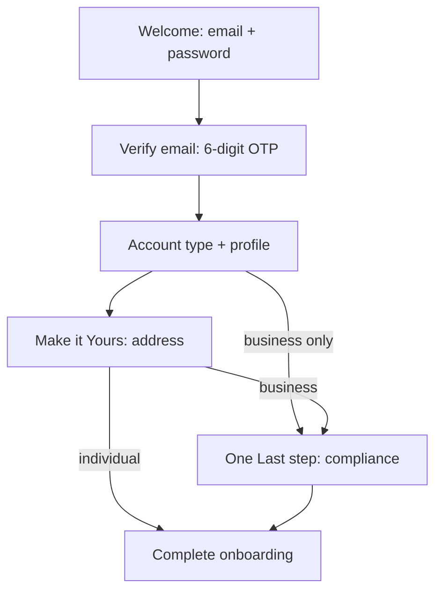

# Product Onboarding API

Open signup and multi-step account setup for Open HR. This flow is **separate** from the [waitlist API](../waitlist/): anyone can register with email and password; waitlist endpoints remain unchanged.

**Status:** API design only — endpoints are documented in OpenAPI and return `501 Not Implemented` until handlers are built.

Interactive documentation (Scalar) is available at `/` when the server runs in a non-production environment.

## Base URL

```
/api/v1
```

Example local base: `http://localhost:8080/api/v1`

## Flow overview



## Domains

| Folder | Description |
|--------|-------------|
| [auth](./auth/) | Signup, email verification, login, token refresh |
| [profile](./profile/) | Account type (individual / business) and name fields |
| [address](./address/) | Workspace address (search or manual entry) |
| [business](./business/) | Business compliance step (business accounts only) |
| [session](./session/) | Onboarding progress and completion |
| [reference](./reference/) | Product-specific catalogs (business types, industries, company roles) |

Countries for dropdowns reuse the existing waitlist endpoint: `GET /api/v1/countries`.

## UI-to-endpoint mapping

| UI screen | Fields | Endpoint(s) | Account types |
|-----------|--------|-------------|---------------|
| Welcome to Open HR | `email`, `password` | `POST /auth/signup` | all |
| Verify your email | 6-digit `code`; resend; edit email | `POST /auth/verify-email`, `POST /auth/resend-verification`, `PATCH /auth/signup` | all |
| How will you use Open HR? | `account_type` | `PUT /onboarding/profile` | all |
| Individual branch | `first_name`, `last_name`, `country_id` | `PUT /onboarding/profile` | individual |
| Business branch | `legal_business_name`, `legal_full_name`, `company_role_id` | `PUT /onboarding/profile` | business |
| Make it Yours | `country_id`, address | `PUT /onboarding/address` | all |
| One Last step | `business_type_id`, `industry_id`, `employee_count` | `PUT /onboarding/business` | business only |

## Branching rules

The server enforces account-type branching:

| Account type | Required steps before `POST /onboarding/complete` |
|--------------|---------------------------------------------------|
| `individual` | `verify_email` → `profile` → `address` |
| `business` | `verify_email` → `profile` → `address` → `business` |

- `PUT /onboarding/business` returns `400` with code `invalid_account_type_branch` when `account_type` is `individual`.
- `POST /onboarding/complete` returns `400` with code `onboarding_step_incomplete` if mandatory steps are missing.

## Authentication

After email verification, the client receives JWT access and refresh tokens. Onboarding step endpoints require:

```
Authorization: Bearer <access_token>
```

Tokens include `sub` (user UUID) and `region` (`uk`, `us`, `africa`, `eu`) for data residency routing.

## Response envelope

Success and error responses use the same envelope as the waitlist API:

```json
{ "data": { ... }, "meta": { "request_id": "..." } }
```

```json
{ "error": { "code": "...", "message": "...", "details": { ... } }, "meta": { ... } }
```

## Database design

Schema design is documented in [`db/migrations/DESIGN_accounts.md`](../../db/migrations/DESIGN_accounts.md). Password hashes and profile data live in regional databases; global registry holds email index and product catalogs.

## Adding endpoints

When implementing handlers:

1. Use `@Tags onboarding/<domain>` or `@Tags auth` in handler godoc.
2. Add the tag to the **Onboarding** group in [`internal/docs/taggroups.go`](../../internal/docs/taggroups.go).
3. Document the endpoint under `docs/onboarding/<domain>/`.
4. Run `make swagger` to regenerate the OpenAPI spec.
