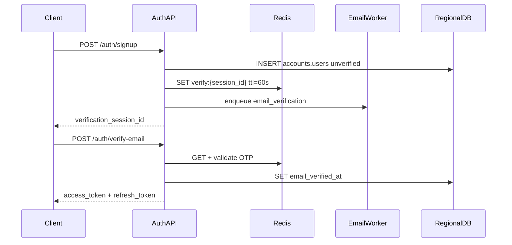

# Auth

Email/password signup, 6-digit email verification, login, and token refresh. Auth endpoints are reused after onboarding completes.

Base path: `/api/v1/auth`

**Status:** Design only — not yet implemented.

## Endpoints

| Method | Path | Description |
|--------|------|-------------|
| `POST` | `/signup` | Create unverified user; send OTP email |
| `PATCH` | `/signup` | Change email before verification (invalidates prior OTP) |
| `POST` | `/verify-email` | Validate 6-digit code; return JWT pair |
| `POST` | `/resend-verification` | Rate-limited OTP resend |
| `POST` | `/login` | Email + password for returning users |
| `POST` | `/refresh` | Rotate access token |

## Sequence



## POST /auth/signup

Creates an unverified user and sends a 6-digit verification code by email.

### Request

```json
{
  "email": "jerry@example.com",
  "password": "secure-password-here"
}
```

| Field | Rules |
|-------|-------|
| `email` | Required, valid email, max 254 chars |
| `password` | Required, min 8 chars, max 128 chars |

### Response `201`

```json
{
  "data": {
    "verification_session_id": "550e8400-e29b-41d4-a716-446655440000",
    "email": "jerry@example.com",
    "code_expires_in_seconds": 60,
    "resend_available_in_seconds": 30
  }
}
```

### Errors

| Status | Code | When |
|--------|------|------|
| `400` | `VALIDATION_ERROR` | Invalid body |
| `409` | `email_already_registered` | Email already has a verified account |
| `500` | `INTERNAL_ERROR` | Server error |

## PATCH /auth/signup

Updates the email on an unverified signup. Invalidates any existing OTP for the prior session.

### Request

```json
{
  "verification_session_id": "550e8400-e29b-41d4-a716-446655440000",
  "email": "newemail@example.com"
}
```

### Response `200`

Same shape as `POST /auth/signup` with a new `verification_session_id`.

## POST /auth/verify-email

Validates the 6-digit OTP and marks the email verified. Returns JWT tokens and initial onboarding status.

### Request

```json
{
  "verification_session_id": "550e8400-e29b-41d4-a716-446655440000",
  "code": "224879"
}
```

| Field | Rules |
|-------|-------|
| `code` | Required, exactly 6 digits |

### Response `200`

```json
{
  "data": {
    "access_token": "eyJhbGciOiJIUzI1NiIs...",
    "refresh_token": "eyJhbGciOiJIUzI1NiIs...",
    "expires_in": 3600,
    "onboarding": {
      "status": "in_progress",
      "current_step": "profile",
      "completed_steps": ["verify_email"]
    }
  }
}
```

### Errors

| Status | Code | When |
|--------|------|------|
| `400` | `invalid_verification_code` | Wrong OTP (max 5 attempts per session) |
| `400` | `verification_expired` | OTP TTL elapsed |
| `404` | `NOT_FOUND` | Unknown `verification_session_id` |

## POST /auth/resend-verification

Sends a new OTP for an existing unverified signup.

### Request

```json
{
  "verification_session_id": "550e8400-e29b-41d4-a716-446655440000"
}
```

### Response `200`

```json
{
  "data": {
    "verification_session_id": "550e8400-e29b-41d4-a716-446655440000",
    "email": "jerry@example.com",
    "code_expires_in_seconds": 60,
    "resend_available_in_seconds": 30
  }
}
```

### Errors

| Status | Code | When |
|--------|------|------|
| `429` | `verification_rate_limited` | Resend requested before cooldown (30s) |

## POST /auth/login

Authenticates a verified user.

### Request

```json
{
  "email": "jerry@example.com",
  "password": "secure-password-here"
}
```

### Response `200`

```json
{
  "data": {
    "access_token": "eyJhbGciOiJIUzI1NiIs...",
    "refresh_token": "eyJhbGciOiJIUzI1NiIs...",
    "expires_in": 3600,
    "onboarding": {
      "status": "completed",
      "current_step": null,
      "completed_steps": ["verify_email", "profile", "address", "business"]
    }
  }
}
```

`onboarding` reflects current progress so returning users can resume incomplete setup.

## POST /auth/refresh

Exchanges a valid refresh token for a new access token.

### Request

```json
{
  "refresh_token": "eyJhbGciOiJIUzI1NiIs..."
}
```

### Response `200`

```json
{
  "data": {
    "access_token": "eyJhbGciOiJIUzI1NiIs...",
    "expires_in": 3600
  }
}
```

## OTP and Redis design

| Key | Value | TTL |
|-----|-------|-----|
| `verify:{session_id}` | `{ "code": "224879", "email": "...", "user_id": "...", "attempts": 0 }` | 60 seconds |
| `verify:resend:{session_id}` | `1` (cooldown marker) | 30 seconds |

- Maximum **5** verification attempts per session; further attempts return `invalid_verification_code`.
- Resend generates a new code and resets the 60s TTL.
- Redis is already required at server startup (`REDIS_URL`).

## JWT design

Access token claims:

```json
{
  "sub": "<user_uuid>",
  "region": "uk",
  "email_verified": true,
  "exp": 1234567890
}
```

Refresh tokens are opaque or JWT with longer TTL. Configuration (implementation phase):

| Env var | Default |
|---------|---------|
| `JWT_SECRET` | required in production |
| `JWT_ACCESS_TTL` | `3600` (seconds) |
| `JWT_REFRESH_TTL` | `604800` (7 days) |

## Email

Job type `email_verification` sends the 6-digit code. Template includes expiry note matching the 60-second TTL shown in the UI.
